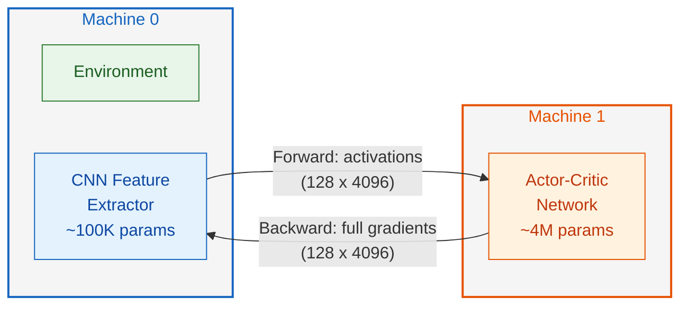
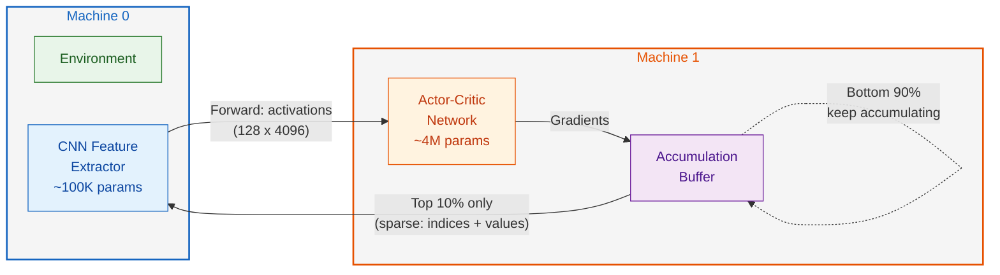
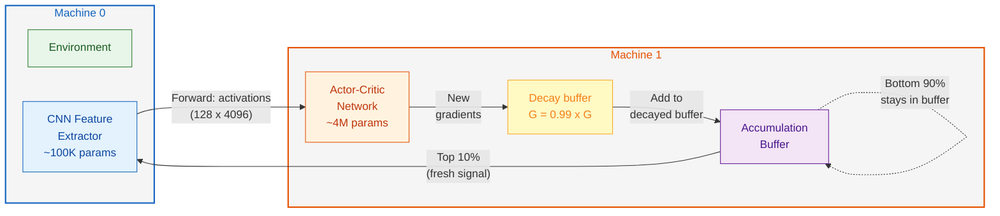

# Thesis Defense Presentation Plan

**Title:** Efficient Pipeline Parallelism for Reinforcement Learning
**Duration:** 20 minutes, 24 slides
**Presenter:** Faiz Ahmed
**Committee:** Dr. Genya Ishigaki (Advisor), Dr. Fabio Di Troia, Dr. Jelena Gligorijevic

---

## Slide-by-Slide Plan

### Slide 1 -- Title

- "Efficient Pipeline Parallelism for Reinforcement Learning"
- Faiz Ahmed
- MS Computer Science, Spring 2026
- Committee: Dr. Genya Ishigaki (Advisor), Dr. Fabio Di Troia, Dr. Jelena Gligorijevic
- **Source:** Rework existing slide 1 (add degree program, semester, committee names)
- **Checklist:** 01 (admin info)

---

### Slide 2 -- What is Reinforcement Learning?

- RL is a family of algorithms that allow learning an objective without training data
- Agent/environment loop diagram (state, action, reward)
- **Source:** Keep existing slide 2 as-is
- **Checklist:** --

---

### Slide 3 -- Zooming into the Agent

- CarRacing screenshot as observation input
- Agent outputs: Left/Right, Gas, Brake
- "Apply action for next observation"
- **Source:** Keep existing slide 3 as-is
- **Checklist:** --

---

### Slide 4 -- Motivation: Why Does This Matter?

- RL models require a lot of training before they converge
- Complex environments require large computational resources
- Ground it in real-world scenarios:
  - Autonomous vehicles: on-board camera processes images locally, must offload policy computation to edge server over wireless link
  - IoT sensor networks: no single node has enough memory for the full model
- These are bandwidth-constrained settings -- communication cost matters
- **Source:** Rework existing slide 4. Keep the core message but add real-world grounding instead of just generic bullets.
- **Checklist:** 02 (motivation -- real-world consequence, not just "open problem")

---

### Slide 5 -- Cloud Setup

- Diagram: environment on resource-constrained device, full agent on cloud
- Device sends observations (~1MB image) to cloud, cloud sends actions back
- **Source:** Keep existing slide 5 as-is
- **Checklist:** --

---

### Slide 6 -- Cloud Gets Expensive

- Same diagram with red box highlighting observation transfer
- "This gets expensive when the observation is large"
- **Source:** Keep existing slide 6 as-is
- **Checklist:** --

---

### Slide 7 -- Research Goal

- "Reduce the amount of data we have to send over the network while training an RL algorithm"
- Add measurable metric: "Target: reduce gradient communication by >= 30% while maintaining policy performance within 10% of uncompressed baseline"
- Evaluated on CarRacing-v3 with PPO
- **Source:** Rework existing slide 7. Keep the plain-language goal, add the measurable metric below it.
- **Checklist:** 03 (research statement with measurable success metric)

---

### Slide 8 -- Training Setup

- Docker Compose: two containers connected by bridge network
- CarRacing environment on Machine 0
- Agent on Machine 1
- N/W communication: 36,000 numbers in each observation
- "We measure the N/W usage"
- **Source:** Keep existing slide 8 as-is
- **Checklist:** --

---

### Slide 9 -- Agent Architecture

- CNN (100K params) -> 4096 features -> Actor (2M params) + Critic (2M params)
- 36,000 input numbers compressed to 4096 by the feature extractor
- "Last Layer of Feature Extractor (4096 numbers)"
- **Source:** Keep existing slide 9 as-is
- **Checklist:** --

---

### Slide 10 -- Pipeline Parallelism: Split the Agent

- CNN on Docker Container 1 (Machine 0), Actor-Critic on Docker Container 2 (Machine 1)
- N/W communication now sends 4096 numbers instead of 36,000
- "Reduce 36,000 numbers to 4096 numbers"
- **Source:** Keep existing slide 10 as-is
- **Checklist:** --

---

### Slide 11 -- But There Is a Problem!

- "We saw that the data transfer increased by ~2x after we split the network"
- **Source:** Keep existing slide 11 as-is
- **Checklist:** --

---

### Slide 12 -- Why? Two RL Phases

- RL has 2 phases:
  1. Policy Rollout -- interact with env and collect data
  2. Training Phase -- use the collected data to update the agent
- **Source:** Keep existing slide 12 as-is
- **Checklist:** --

---

### Slide 13 -- Rollout Savings, But Training...

- Table: 10x reduction in network usage during Policy Rollout Phase
  - Cloud: 14.7B tensors, ~28 GB
  - Naive Split: ~1.6B tensors, 3.2 GB
- "But in the training phase..."
- **Source:** Keep existing slide 13 as-is
- **Checklist:** --

---

### Slide 14 -- Cloud: No Network During Training

- In cloud setup, observations are stored on the cloud
- Training happens locally -- no network needed
- **Source:** Keep existing slide 14 as-is
- **Checklist:** --

---

### Slide 15 -- Split: Activations + Gradients Every Step

- Since the model is split across machines, we need to send activations and gradients on every training step
- **Source:** Keep existing slide 15 as-is
- **Checklist:** --

---

### Slide 16 -- 66 GB Additional vs 0 GB

- "In our split setup, this was an additional 66 GB of data transfer vs 0 GB for cloud setup"
- **Source:** Keep existing slide 16 as-is
- **Checklist:** --

---

### Slide 17 -- Related Work (NEW)

- **Deep Gradient Compression** (Lin et al., ICLR 2018): Sparsifies gradients in data-parallel training by sending only top 0.1% by magnitude. Designed for supervised learning with data parallelism. Ours adapts the sparsification idea to pipeline-parallel RL with a local accumulation buffer.
- **GPipe** (Huang et al., NeurIPS 2019) / **PipeDream** (Narayanan et al., SOSP 2019): Introduced pipeline parallelism for training large supervised models. Focus on throughput and memory, not on reducing communication volume.
- How ours differs: we target the gradient communication bottleneck specific to pipeline-parallel RL, where PPO's multi-epoch training amplifies the overhead.
- Full references in footnotes on the slide.
- **Source:** New slide
- **Checklist:** 04 (related work with explicit comparison, full references in footnotes)

---

### Slide 18 -- Preliminary Approach: Stats-Based Compression

- Solutions tried: (1) Stats-based gradient compression, (2) Gradient accumulation
- Stats-based: don't send gradients, send mean and std deviation instead. Machine 0 samples from this to update CNN.
- Result: model converged slowly, data needed to reach comparable performance exceeded naive split learning
- Takeaway: summarizing gradients loses too much information
- **Source:** Compress existing slides 17-19 into one slide. Keep the key chart from slide 19 if space allows.
- **Checklist:** --

---

### Slide 19 -- The Problem With Full Gradient Transfer (NEW)

**Title:** "Standard Pipeline: Send Everything, Every Time"

**Bullet points (top of slide):**
- Every minibatch: Machine 0 sends activations forward, Machine 1 sends **full gradients** back
- 32 minibatches x 10 epochs = **320 full round-trips per iteration**

**Mermaid diagram (center of slide):**

**Verbal:** "This is what we want to reduce -- the backward gradient transfer."
- **Source:** New slide
- **Checklist:** 05 (methodology -- sets up why our approach is needed)

---

### Slide 20 -- Our Method: Accumulate and Sparsify (NEW)

**Title:** "Our Method: Send Only What Matters"

**Mermaid diagram (center of slide):**

**Bullet points (below diagram, max 2 lines):**
- Only gradients above the 90th percentile magnitude are sent; the rest stay in the buffer
- Unsent gradients keep accumulating until they become large enough to cross the threshold

- **Source:** New slide
- **Checklist:** 05 (methodology -- replicable description, framework diagram, justification)

---

### Slide 21 -- Buffer Decay: Solving Staleness (NEW)

**Title:** "Adding Buffer Decay to Handle Staleness"

**Bullet point (top, 1 line):**
- Problem: without decay, old gradients pile up and become stale -- decay discounts them before adding new ones

**Mermaid diagram (center of slide) -- same layout as slides 19/20, decay step added:**

**Bullet points (below diagram, 2-3 lines):**
- Each minibatch: old buffer is multiplied by 0.99 before new gradients are added
- 32 minibatches x 10 epochs = 320 decays per iteration -- retention: 0.99^320 ~ 4%
- Old gradients are effectively forgotten; only recent signal crosses the threshold

- **Source:** New slide
- **Checklist:** 05 (methodology continued)

---

### Slide 22 -- Warm Start (NEW)

**Title:** "Warm Start"

- First N steps: send full gradients with no compression to let the model develop stable initial weights
- After warm start: gradient accumulation with sparsification and buffer decay activates
- Early gradients are noisy and the model needs every update to stabilize before we start filtering

- **Source:** New slide
- **Checklist:** 05 (methodology continued)

---

### Slide 23 -- Experimental Setup and Assumptions (NEW)

**Setup:** CarRacing-v3, 96x96 RGB images, continuous actions (steer, gas, brake). Two Docker containers on bridge network using PyTorch RPC.

**Parameter ranges:**

| Parameter            | Values Tested               |
| -------------------- | --------------------------- |
| Percentile threshold | 90th, 95th, 99th            |
| Buffer decay (λ)     | 1.0 (no decay), 0.99        |
| Random seeds         | 2 seeds per config          |
| Training budget      | 1M timesteps                |
| Minibatches x Epochs | 32 x 10 = 320 per iteration |
| Warm start           | 30K steps                   |

**Realistic assumptions:**
- Two separate compute nodes communicating over a network link
- Full tensor serialization via PyTorch RPC for every transfer

**Simplifying assumptions:**
- Single environment (CarRacing-v3), fixed network architecture
- Docker bridge network has higher bandwidth and lower latency than a real wireless link
- No packet loss, variable latency, or channel noise

**Limitations:** Tested on one environment with one architecture. Larger models or different domains may behave differently.

- **Source:** New slide
- **Checklist:** 06 (simulation setup -- realistic assumptions, simplifying assumptions, limitations)

---

### Slide 24 -- Training Results (NEW)

- **Figure:** exp4_episodic_returns.pdf (training curves over ~692K steps)
- Three configurations:
  - Baseline (no compression): ~496 EMA return, crashes at iteration 169
  - 90th percentile without decay: 304 EMA return
  - 90th percentile + 0.99 decay: 719 EMA return
- Warm start boundary marked at 30K steps
- **Takeaway:** "Buffer decay variant surpasses the uncompressed baseline by 45%. Without decay, compression degrades performance to 61% of baseline."
- **Source:** New slide, figure from thesis
- **Checklist:** 07 (results with labeled axes, takeaway sentence)

---

### Slide 25 -- Results Summary (NEW)

- **Summary table:**

| Config          | Transfer | Reduction | Mean Eval Return |
| --------------- | -------- | --------- | ---------------- |
| No compression  | 266 GB   | --        | 534.63           |
| 90th percentile | 173 GB   | 35%       | 285.56           |
| 90th + decay    | 173 GB   | 35%       | 572.52           |

- Both compressed configs send the same amount of data (35% less). Decay doesn't change how much is sent -- it changes the quality of what's sent.
- **Takeaway:** "Same 35% compression, but decay is the difference between 53% and 107% of baseline performance."
- Additional findings: 95th percentile (5% sent) learns slowly. 99th percentile (1% sent) doesn't learn at all. Results reproduced across multiple random seeds.
- Optionally include box plot figure (exp4_performance_comparison.pdf) or cumulative transfer figure (exp4_network_transfer.pdf) if space allows.
- **Source:** New slide, data from thesis Chapter 5
- **Checklist:** 07 (results addressing stated metrics, takeaway sentence)

---

### Slide 26 -- Conclusion + Future Work + Questions (NEW)

- **Contributions:**
  1. Quantified communication overhead of pipeline parallelism for RL (2.4x vs centralized)
  2. Gradient accumulation with percentile sparsification + buffer decay: 35% reduction in data transfer with no performance loss
  3. Identified gradient staleness as the critical failure mode; exponential decay solves it
- **Future Work:**
  - Adaptive percentile thresholds (higher compression as gradients stabilize later in training)
  - Combining sparsification with quantization for further reduction
  - Testing on larger networks and more complex environments
- "Questions?"
- **Source:** New slide
- **Checklist:** --

---

## Pacing Summary

| Section | Slides | Time | Source |
|---------|--------|------|--------|
| RL Background | 1-3 | ~2 min | Existing |
| Motivation + Cloud + Goal | 4-7 | ~3 min | Existing (reworked) |
| Setup + Architecture | 8-10 | ~2 min | Existing |
| The Problem | 11-16 | ~3 min | Existing |
| Related Work | 17 | ~1 min | New |
| Preliminary Work | 18 | ~1 min | Reworked |
| Our Method | 19-22 | ~4 min | New |
| Experimental Setup | 23 | ~1 min | New |
| Results | 24-25 | ~2 min | New |
| Conclusion | 26 | ~1 min | New |

---

## Checklist Coverage

| # | Requirement | Slide(s) |
|---|-------------|----------|
| 01 | Admin info (name, degree, semester, committee, slide numbers) | 1, all slides |
| 02 | Motivation grounded in real-world consequence | 4 |
| 03 | Research statement with measurable metric | 7 |
| 04 | Related work with explicit comparison + footnote references | 17 |
| 05 | Methodology (replicable, framework diagram, justification) | 19, 20, 21, 22 |
| 06 | Simulation setup (realistic + simplifying assumptions, limitations) | 23 |
| 07 | Results (figures/tables addressing stated metrics, takeaway sentences) | 24, 25 |

---

## New Figures Needed

- exp4_episodic_returns.pdf -- training curves (slide 24)
- exp4_performance_comparison.pdf -- evaluation box plots (optional, slide 25)
- exp4_network_transfer.pdf -- cumulative data transfer (optional, slide 25)

## New Visuals to Create

- Mermaid flow diagram for slide 19 (full gradient transfer baseline)
- Mermaid flowchart for slide 20 (accumulation + sparsification)
- Mermaid flow diagram for slide 21 (decay added to the loop)
